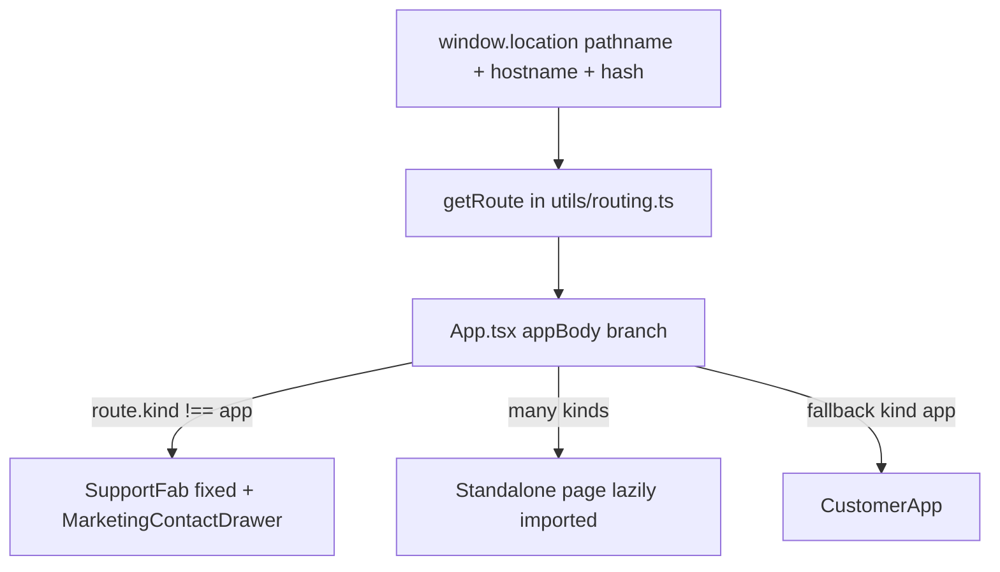

# H5 shell, routing & marketing overlay

Single map of how **pathname → top-level UI** works, where **marketing** ends and **`/app` (customer shell)** begins, and which **floating panels** attach where.  

**Maintain this doc** when you add a top-level route, move a drawer, or change global chrome.

---

## 1. Authority graph

- **`utils/routing.ts`** — `getRoute()`: deterministic `Route` discriminated union (no React Router yet).
- **`App.tsx`** — Chooses **`appBody`** from `route.kind`; renders **global FAB + contact drawer** when `route.kind !== 'app'`.
- **`CustomerApp`** (inline in **`App.tsx`**) — Shop / SIMs / profile hashes, session storage tabs, Stripe sheets, nested views.

---

## 2. `getRoute()` → screen (pathname highlights)

| `route.kind` | Typical pathname / condition | Primary component (`App.tsx` `useMemo`) |
|----------------|-----------------------------|----------------------------------------|
| `marketing` | `/` on `evairdigital.com` / `www`, or `/welcome`, `/marketing` | `MarketingPage` |
| `marketingPreview` | `/welcome-preview` | `MarketingPageRedesignPreview` |
| `device` | `/sim/phone`, `/sim/camera`, `/sim/iot` | `DeviceLandingPage` |
| `travel` | `/travel-esim`, `/travel-esim/{iso2}` | `TravelEsimPage` |
| `help` | `/help`, `/help/{slug}` | `HelpCenterPage` |
| `blog` | `/blog`, `/blog/{slug}` | `BlogPage` |
| `legal` | `/legal/terms`, `/privacy`, `/refund` | `LegalPage` |
| `activate` | `/activate` | `ActivatePage` |
| `topup` | `/top-up` (+ tab segment/query) | `TopUpPage` |
| `apiTest` | hash contains **`api-test`** | `ApiTestPage` |
| **`app`** | **Everything else** (including **`/app`**, **`/app/*`**, non-apex `/`, unknown `/sim/foo`, etc.) | **`CustomerApp`** |

Host-based marketing on `/` lives in **`MARKETING_HOSTS`** inside **`routing.ts`** (apex only).

---

## 3. Customer shell (`route.kind === 'app'`)

- **Entry**: Flutter shell and browsers load **`https://evairdigital.com/app`** by default (`product-decisions` / Flutter `h5Url`).
- **In-app tabs** are driven by **`activeTab`** + URL **hash fragments** synced via **`hashFragmentForTab()`** (`#esim`, `#sim-card`, `#profile`, `#inbox`, `#contact`, …).
- **Wide desktop (not WebView / not `#app-preview`)**: **`Profile`** and **`Inbox`** can render as **`AppShellFloater`** above the storefront (`shellFloatOpen`); closing restores browse hash **`#esim`** / **`#sim-card`**.
- **Layouts**: **`layoutFullBleed`** / `html.app-shell` toggles live inside **`CustomerApp`** (eSIM storefront vs phone-frame metaphors)—see **`App.tsx`** comments near **`condensedCustomerChrome`**.

Canonical shop catalogue flows through **`services/dataService.ts`** (not `packageService` for listing)—see **`.cursor/rules/esim-api-services.mdc`**.

---

## 4. Marketing / public chrome (any `route.kind !== 'app'`)

- **`SupportFab`** (**`layout="fixed"`)** opens **`MarketingContactDrawer`** (same stacking as inbox/profile marketing drawers).
- **Site header logged-in extras** (`SiteHeaderAccountActions`):
  - **Inbox** → **`MarketingInboxDrawer`** (portal to `document.body`, `z-[70]` / `71`).
  - **Profile** → **`MarketingProfileDrawer`** (same geometry; stays on **current pathname** — does **not** navigate to `/app#profile`).
- **Bridge event** (**`utils/evairMarketingEvents.ts`**): dispatch **`EVAIR_OPEN_MARKETING_CONTACT_EVENT`** (“Contact Us” from profile on marketing); **`App.tsx`** listens and sets **`marketingSupportOpen`**, unless **`getRoute().kind === 'app'`**.

---

## 5. Contracts (do not regress silently)

| Concern | Contract |
|---------|----------|
| New top-level path | Extend **`Route`**, **`getRoute()` matcher**, **`App.tsx` `useMemo`** branch + title effect if needed. |
| Catalogue / shop list | **`fetchPackages` / prefetch** via **`dataService.ts`** facade (supplier/backstage paths per rules—not `packageService` for catalogue). |
| Marketing contact from nested UI | Prefer **`CustomEvent`** `EVAIR_OPEN_MARKETING_CONTACT_EVENT` instead of **`/app#contact`** so public pages never mount **`CustomerApp`**. |
| Deep link for native shell | **`/app#…`** hashes remain valid for bookmarks and WebView (**`CustomerApp`** hash listeners). |

---

## 6. Related docs & rules

- **`docs/ACTIVATION_FUNNEL.md`** — Activate / top-up funnel and backend touchpoints.
- **`utils/routing.ts`** — Source of truth for path matching (`Route` type).
- **`.cursor/rules/esim-api-services.mdc`** — Shop catalogue routing guardrail.
- **`CLAUDE.md`** — Build commands and stacked architecture notes.

---

## 7. Changelog notes (optional agents)

Append one line when merging shell-affecting work (date + one sentence).

- **2026-05-01** — Initial document: `getRoute` table, marketing vs `/app`, `AppShellFloater` / marketing drawers / `EVAIR_OPEN_MARKETING_CONTACT_EVENT`; CLAUDE + agent start wired.
